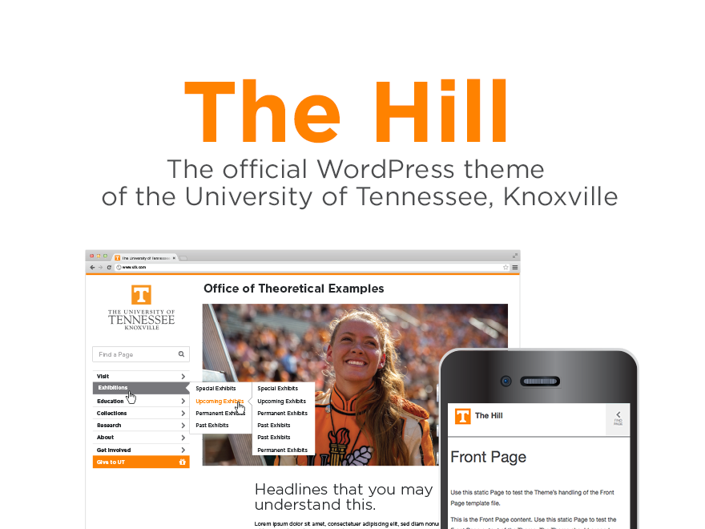

# The 2015 UT WordPress Theme (The Hill)

***
Version: 1.0.5
Updated: Jan 27, 2016
- Title attribute added to "Find Page" for screen Readers.
- Lang attribute added to HTML element.
- Increased contrast on 'lighter' text elements for readabilty/accessibility.
- Added button and title attributes to search elements for accessibility.
- Added attribute option of "outline" to highlight boxes.

***

Version: 1.0.4
Updated: Nov 18, 2015
- Button Color Styles, and highlight box colors... all combos now pass WCAG AA.
	- Replacing `style.css` will take care of this.
- Banner role re-worked to make landmarks clearer.
	- Remove the `role="banner"` attribute from the second header.
	- Add: `<h2 class="sr-only"><a href="/" rel="home">UNIT NAME</a></h2>` in the main banner.
- Remove all `tabindex` attributes, to prevent accidental keyboard traps.
- "Skip to Content" feature made visible on focus.
	- Add the class " sr-only-focusable" to the Skip to Content link.

***

Version: 1.0.3
Updated: Sept 18, 2015
- A few updates for accessiblity in the JS and CSS.
- Bug fix on the search form in the HTML templates.
- The WordPress theme updated to accomodate changes in WordPress 4.3.
- Various other rendering bugs fixed.
***

Version: 1.0.2
Updated: August 3, 2015
- Alignment issues on a handful of interface elements.
- New minifying CSS functionality. (For gulp/sass)
- Jquery CDN cahgned for Chinese compatiblitly (China blocks google)

***

Version: 1.0.1
Updated: July 1, 2015
- Menu bug fixes
- Resizing the screen flash fixes
- Parent Unit functionality change
- Various other bugs squashed

***

Version: 1.0
Updated: June 8, 2015

